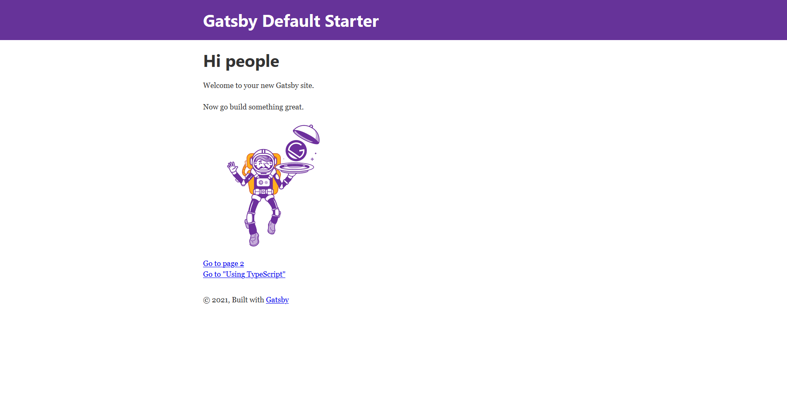
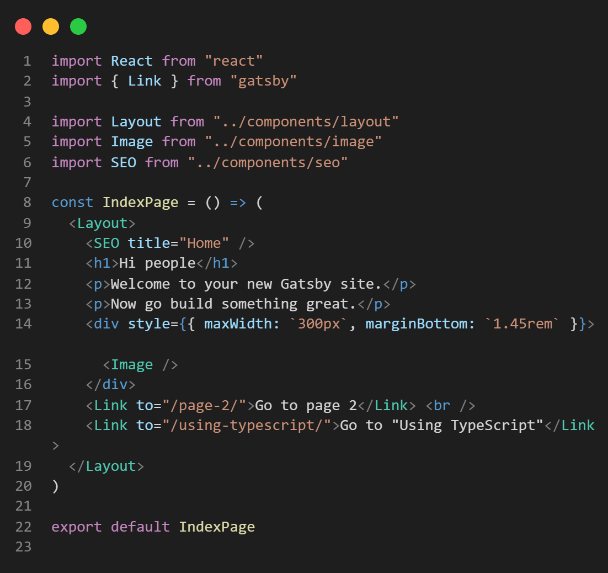
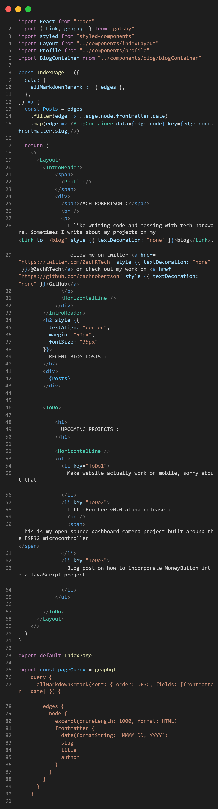
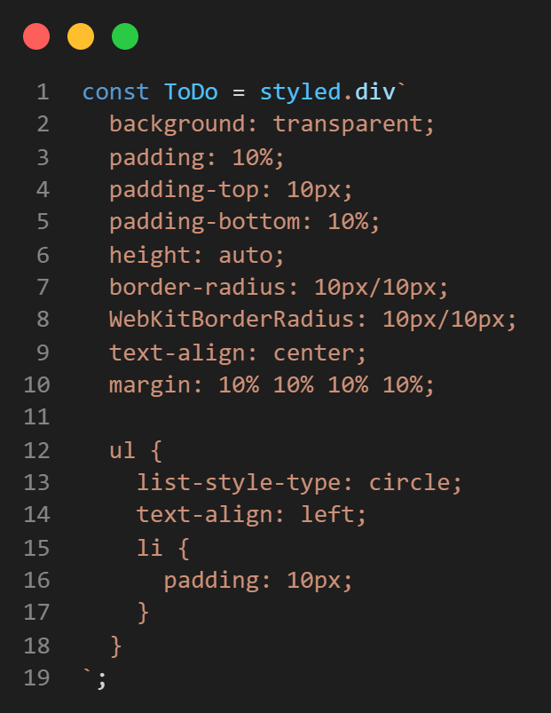
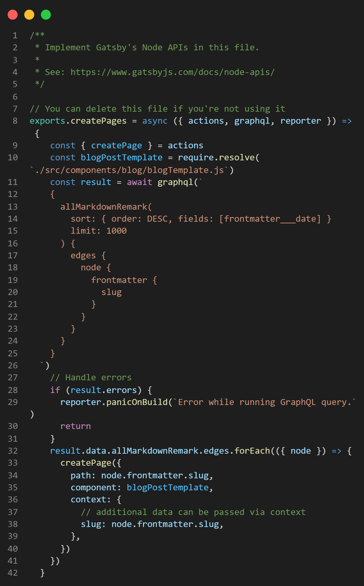
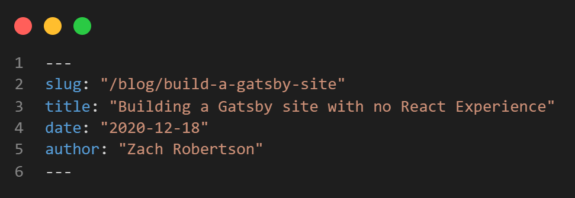

## GatsbyJS

*********************************

Gatsby is a fast, easy to use JavaScript framework, specifically for making static sites. It is built on React and before I built this site I had never touched JavaScript or React. I want to share my experience and some tips Ive learned along the way. Also check out [this GatsbyJS showcase](https://www.gatsbyjs.com/showcase/)

### Getting Started

*********************************
The best way to make a gatsby site in my opinon is to start with the default to learn how each of the components work.
To get the default gatsby site working make sure NodeJS is installed then run this in a terminal (Windows PowerShell):

1. `npm install -g gatsby-cli`
2. `gatsby new new-gatsby-site`
3. `cd new-gatsby-site`

After this you should have a new repository named `new-gatsby-site`. Now run `gatsby develop` and navigate to [http://localhost:8000](http://localhost:8000) in your chosen browser, you should see the following:

If you see this screen congratulations, you have successfully started a gatsby development environment with a working website. Now you probably want to make it look like your own, to start I would suggest getting familiar with what is happening in each of the default page files. Here is the code for the home page.

In this file we have a React component called `IndexPage` that is being exported, and since it is in the pages sub-directory it will use the exported React component to create a page with the domain route the same as the file name (with the index file being the home page). This react component just exports a few lines of JSX, which is a JavaScript syntax that allows you to use HTML tags, but there is a lot of short shorthand in this example.

Below is what my index page looked like when I was writing this post, I left out the styling so it is not too long but I will talk about that later.

### Imports

List most other programs we need to import our dependencies, if you want to create a react component you have to import React, next I used Link and graphql from gatsby, as well as a plugin called styled components. The last three imports are local React components ill get to in a few sections.

### GraphQL

GraphQL is a powerful tool that lets you query for things like files and images as well as site metadata.

***It is important to note that you can only use GraphQL queries on files in the /pages directory***

This is something that gave me some trouble. There are ways to get around it but they are not the easiest solutions for a React/JavaScript beginners.

The important thing to know about GraphQL queries in gatsby is that when they are defined their data becomes available to the react component on that page, so the `data` property that is based to `IndexPage`, in the code about, is the return from the GraphQL query.

### React component

React can do a lot of things but it is very useful in gatsby to return JSX element. This is what my index page does. But there are also other tags that are not HTML or imported React components, these are styled HTML tags defined below the GraphQL query using styled components. This eliminates the need for CSS files, which I like  a lot!

Here is an example of a styled HTML tag using styled components:

### Blog Posts from Markdown Pages

One of the things that gave me a lot of trouble was figuring out how to easily make new blog post. Luckily, gatsby makes this pretty easy. I used a function in `gatsby-node.js` called `createPages()` that iteratively makes a blog post from all of the markdown files in the `/markdown-pages` directory. To make the actual page it uses the `blogTemplate.js`  component.

Take a look at my `gatsby-node.js` file below:

This is pretty complicated but the basic idea is that it is querying for all markdown files and then using `./src/components/blog/blogTemplate.js` to make a blog post with the data in each markdown file. Luckily this is really all that you need to do to get markdown files to create blog posts. Your files do need to be formatted correctly with at least a `slug` property in frontmatter, this looks like:

This is the frontmatter for this post here! You define the frontmatter with the two `---` operators. The slug is all that is necessary for the `gatsby-node.js` GraphQL query to work, but you can query markdown data in other areas (`blogTemplate.js` for example) so it is good to define other useful information here.

### The difference between `gatsby develop` and `gatsby build`

The last thing that gave me trouble as a Gatsby beginner was when I went to deploy my site on [Netlify](https://netlify.com). This site lets you continuously deploy a static site from GitHub for free!

The problem I ran into was an error that said `window is not undefined`. This was caused because I was using an object called window in my `index.js` file to check if the user was on the home page or not. This object accesses the local storage of the browser window, but when you use `gatsby build` it will not have a window object. There are some ways to the code with window in a `componentDidMount()` function but I was unable to get this to work. In the end I just created a seperate header adn layout file for the index page to change the functionality but I hope to change it back to a programatic solution soon.

## Thanks for Reading

*********************************

If you have any questions about my websites code or any other projects of mine you can contact me [here](https://zachrobertson.tech/contact)
